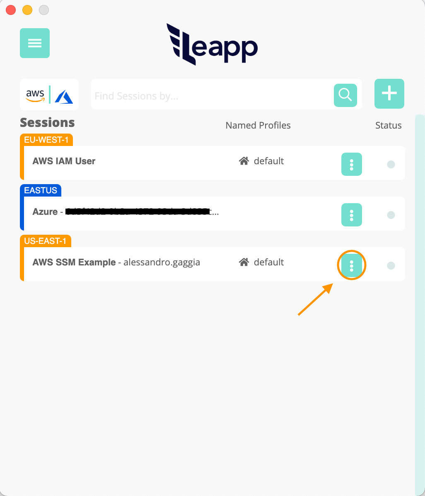
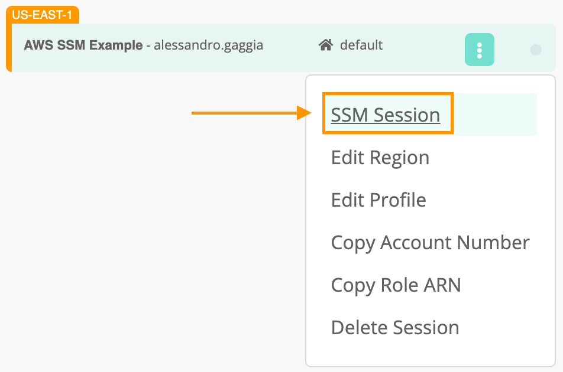
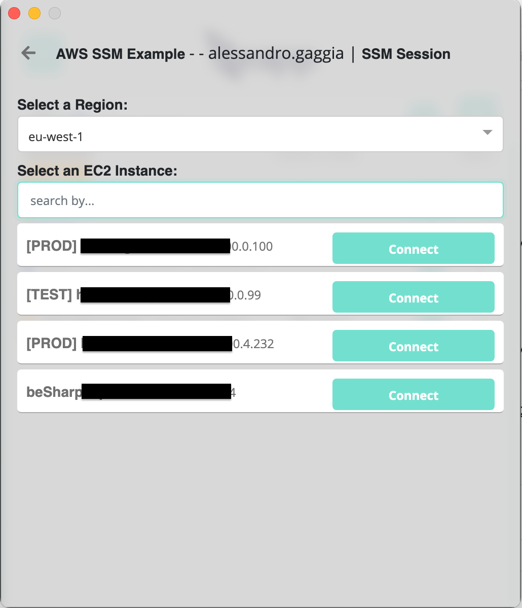
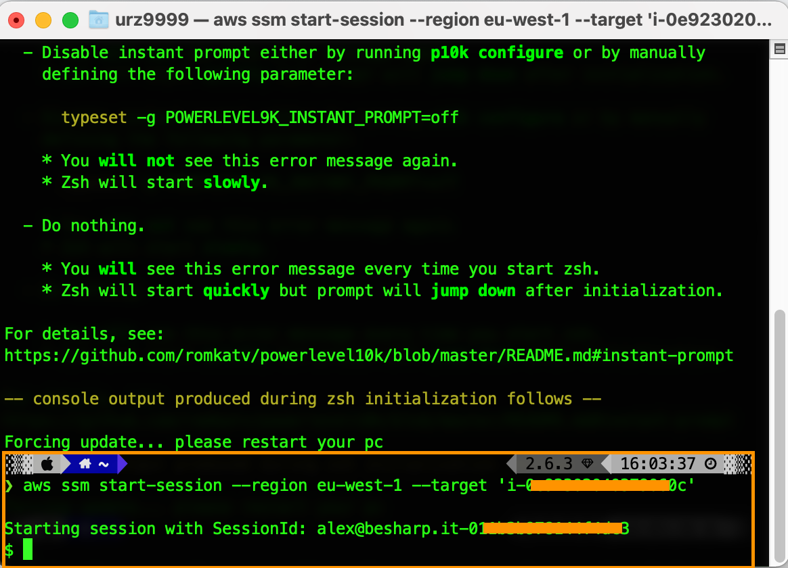

## How to connect to an EC2 instance through Leapp using AWS SSM

### Prerequisites
In order to **connect properly to a remote EC2 instance** using SSM **is necessary to configure the agent and appropriate permissions via AWS console**.

To configure **access** to one or more instances through SSM, follow the steps defined in this [guide](https://docs.aws.amazon.com/systems-manager/latest/userguide/session-manager-getting-started.html).

In particular, you'll also want to check:
- How to set up an SSM Agent for [Linux](https://docs.aws.amazon.com/systems-manager/latest/userguide/sysman-install-ssm-agent.html) EC2 instances
- How to set up an SSM Agent for [MacOS](https://docs.aws.amazon.com/systems-manager/latest/userguide/install-ssm-agent-macos.html) EC2 instances
- How to set up an SSM Agent for [Windows](https://docs.aws.amazon.com/systems-manager/latest/userguide/sysman-install-ssm-win.html) EC2 instances

By default, AWS Systems Manager doesn't have permission to connect to your instances. You must grant access by using an AWS IAM instance profile. To do so, follow this [step](https://docs.aws.amazon.com/systems-manager/latest/userguide/session-manager-getting-started-instance-profile.html).

### Launching an AWS SSM Session using Leapp

With Leapp it is possible to launch a remote session over an AWS EC2 instance by simply clicking on the **kebab menu** near the session information like in the figure.



In the context menu, choose **SSM Session**.



In the modal that should open select the **region** in which your EC2 instance resides. After loadingInBrowser all the available instances in that region, it will be possible to connect.


After selecting the region if one or more instances are available you can SSM into that by clicking the **connect** button.

> Note that Leapp **will not** check if you're are eligible or not to connect, so in case of error, Leapp will stop the procedure telling what went wrong.



In case you have to manage many sessions you can always use the general **searchFilter bar** to filter the specific session you need.


After clicking connect, a terminal will pop up on your system connecting to the selected instance. Once connected you should see a screen similar to this:



Here you'll have to type ```/bin/bash``` in order to fully connect to the machine. After that, you'll have complete remote access to the instance.
